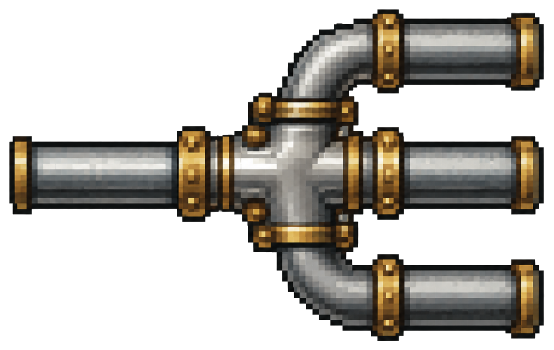
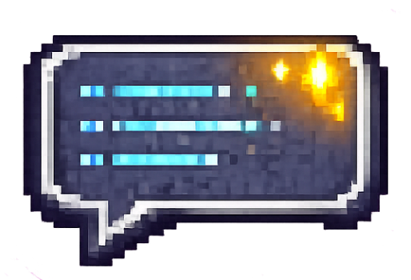
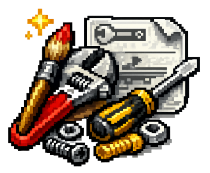

<p align="center">
  
</p>

<div align="center">


</div>

<h1 align="center">pixel-paule</h1>

<p align="center">
<b>Type one sentence. Ship one production-ready website.</b><br>
Design · Build · Animate · Verify — all from a single conversation.
</p>

---

## At a glance

|  |  |
|---|---|
| 🎨 **Design** | Creates a complete visual direction for you |
| 🏗️ **Build** | Generates hand-crafted, production-ready code |
| ✨ **Motion** | Adds tasteful interactions, then reviews them |
| 🏷️ **Brand lock** | Keeps your colors, fonts, logo and voice fixed |
| 🖌️ **80+ styles** | Swiss, Glassmorphism, Brutalism, Bento… |
| ⚙️ **Multi-stack** | Next.js, Astro, React, Vue, Svelte + more |
| 📐 **Layout QA** | Measures overflow, heights, width, contrast |
| 🔍 **SEO / social QA** | Validates meta, OpenGraph and structured data |
| 🖼️ **Asset QA** | Verifies images actually made it into the build |
| ⚡ **Performance QA** | Checks page weight, assets and load timing |

---

## Contents

- [The idea in one minute](#the-idea-in-one-minute)
- [Quick start](#quick-start)
- [How it works](#how-it-works)
- [The three modes](#the-three-modes-it-picks-for-you)
- [Example prompts](#example-prompts)
- [Visual styles](#visual-styles)
- [Tech stack](#tech-stack)
- [Brand input](#brand-input-optional-but-powerful)
- [The two audit gates](#the-two-audit-gates)
- [Install](#install)
- [Power-user shortcuts](#power-user-shortcuts)
- [FAQ](#faq)
- [Credits & licenses](#credits--licenses)

---


## The idea in one minute

Ask an AI to "build me a landing page" and you often get HTML that looks fine but
quietly breaks: sideways scroll on mobile, cards of different heights, grey text on
grey, no `<title>`, a link that previews as a bare URL in Slack. It *looks* done. It
isn't.

pixel-paule is a Claude Code plugin built on two ideas:

| Idea | What it means for you |
|---|---|
| **One conversation partner, many specialists** | You talk to one skill (`website`). It calls the right expert skill at each step and runs its own checks. No skill-picking, no prompt-juggling. |
| **"Done" is measured, not guessed** | Two scripts read the finished page and report problems as hard numbers. A build can't call itself done while a real `error` is still open. |

So you stay at the level of *intent* ("make it calmer", "keep our logo") and the
plugin handles the craft and the checklist underneath. It's an extended fork of
[`website-builder`](https://github.com/Jarek2k/website-builder), adding an **optional
brand lock** and a **built-in SEO / OpenGraph / performance audit**.

---

## Quick start

Getting started takes less than a minute.

**1. Install the plugin**

```bash
claude plugin marketplace add Panhas2209/pixel-paule
claude plugin install pixel-paule@panhas2209
```

Restart Claude Code and verify with `claude plugin list`.

**2. Describe your website** — no syntax, no commands. Just plain words:

> Build a landing page for a calm voice-notes second-brain app.

**3. Answer a few questions.** pixel-paule aligns on audience, the primary action,
and visual direction, then shows a 3–5 bullet plan and **waits for your approval**.

**4. Sit back.** After your OK it runs the full pipeline — build → motion → layout
QA → SEO/perf QA — and only says "done" once every blocking `error` is resolved.

The point: **it confirms the direction before it builds**, so you don't lose five
minutes to a wrong turn.


---


## How it works

`website` is the only way in. It doesn't invent palettes, type, or motion — it calls
the right specialist for each step and passes the work along, so no two builders do
the same job.

```text
Prompt → Plan (you confirm) → Data → Build → Motion → Layout QA → SEO/Perf QA → Done
```

| Step | Who does it | What comes out |
|---|---|---|
| 0 · Brand *(optional)* | `load-brand` | If a `brand.json` exists, its colors/fonts/logo/voice become a fixed rule for every later step. |
| 1 · Data | `website-ux` | Candidate palettes, font pairings, UX rules — reference material, not the final look. |
| 2 · Build | `website-build` | The real page: hand-crafted, non-generic, production-ready code. |
| 3 · Motion | `website-animation` + `website-animation-review` | Small interactions on the moving parts, then a motion review. |
| 4 · Audit (layout) | `verify-composition` | Blocking check: overflow, uneven heights, width use, contrast — with numbers. |
| 4b · Audit (findability) | `verify-seo-perf` | Blocking check: SEO, meta, OpenGraph, structured data, asset parity (images really shipped), load performance. |

Only `website` reacts to your request; it pulls in each specialist when needed. The
specialists are named by what they do and bundled from upstream projects — see
[Credits](#credits--licenses).

---



## The three modes (it picks for you)

You never name a mode. pixel-paule reads your input and chooses:

| You give it… | Mode | What it does |
|---|---|---|
| A description, a brief, or nothing | **New** | Asks 2–3 short questions, shows a quick plan, waits for your OK, then builds → motion → audits. |
| A URL or an existing site | **From reference** | Reads the reference, downloads and self-hosts its images and brand assets, then either rebuilds it closely *or* redesigns it while keeping the brand. |
| A file or project path | **Improve** | Checks the page, fixes problems in place, audits again. Won't change your identity unless you ask. |

---



## Example prompts

You don't learn commands — you describe what you want. Flags like `--keep-brand`,
`--stack …` and `brand=…` are **words you type inside the sentence**, not separate
commands.

| Goal | Say something like… |
|---|---|
| New page from scratch | `Make a pricing page for a B2B analytics tool, trustworthy and dense.` |
| Set the tech stack | `Build a docs landing page. --stack astro` |
| Rebuild a reference 1:1 | `Rebuild https://example.com but with clean, accessible code.` |
| Redesign, keep the brand | `Redesign our site, keep the logo and colors. --keep-brand` |
| Improve an existing file | `Go over ./index.html — fix spacing, typography, SEO and animations.` |
| Audit only, no rebuild | `Audit ./index.html for SEO and layout problems, don't change the design.` |
| Combine everything | `Landing page for a B2B analytics platform in Swiss style. Keep branding via brand.json, use Astro, optimise for SEO. --keep-brand brand=./brand.json` |

---


## Visual styles

You can steer the *look* of the page. The bundled `website-ux` skill ships a catalog
of **80+ named visual styles** — Minimalism / Swiss, Glassmorphism, Neumorphism,
Brutalism, Bento Grid, Claymorphism, Aurora UI, Cyberpunk / HUD, Editorial / Magazine,
Dark Mode (OLED), Data-Dense Dashboard, and many more. Full list:
[ui-ux-pro-max — Available styles](https://github.com/nextlevelbuilder/ui-ux-pro-max-skill#available-styles-67).

No flag needed — just name the style in your prompt:

```text
Build a landing page for a fintech app in a Glassmorphism style, dark mode.
Make a docs homepage — Swiss / Minimalism, lots of whitespace.
Redesign this page as a Bento Grid.
```

You can also nudge intensity in plain words — *"make it bolder"* or *"keep it
calmer"* — and pixel-paule adjusts without you naming a style.

---


## Tech stack

You don't have to name a stack. Say nothing and pixel-paule uses its default; to
force another, add `--stack <name>` to your message.

| | |
|---|---|
| **Default** | **Next.js + Tailwind + shadcn/ui** |
| **Change per build** | add `--stack astro` (or `next`, `vite`, `svelte`, `html`, …) to your prompt |

`--stack` is a hint, so you can name any framework. What makes pixel-paule *smarter*
per stack is the design data bundled with `website-ux`, which covers these **16 stacks**:

| Web | App / native | Other |
|---|---|---|
| `react`, `nextjs`, `vue`, `nuxtjs`, `nuxt-ui`, `svelte`, `astro`, `angular`, `html-tailwind`, `shadcn`, `laravel` | `swiftui`, `react-native`, `flutter`, `jetpack-compose` | `threejs` |

A stack outside this list still works — you just don't get the extra stack-specific
reference data.


---


## Brand input (optional, but powerful)

One of pixel-paule's most powerful features is its ability to stay on-brand automatically.

Instead of describing your company's colors, typography and tone in every conversation, simply provide a brand file once. From that point on, every generated website follows the same visual identity.

Put a `brand.json` (or `brand.yaml`) in your project and pixel-paule keeps every build
on-brand: same colors, fonts, logo, tone, and hard "don'ts". No brand file? Nothing
changes — it builds a look from your brief as usual, and you can add one later without
changing your workflow.

**Where does it go?** In the **root of the project you build the site in**.
pixel-paule finds it automatically (first match wins):

```text
brand.json → brand.yaml → brand.yml → .brand.json → brand/brand.json → brand/brand.yaml
```

Somewhere else? Point at it with `brand=./config/my-brand.json` in your prompt. An
explicit path beats an auto-discovered file, which beats `--keep-brand` + free text.

### Example `brand.json`

```json
{
  "name": "Acme Manufacturing",
  "url": "https://acme.example",

  "colors": {
    "primary": "#0F3D66",
    "accent": "#E8A317",
    "text": "#12212E"
  },

  "fonts": {
    "heading": "Inter",
    "body": "Inter"
  },

  "logo": "assets/logo.svg",

  "voice": "Short, confident sentences. Benefits before features.",

  "doNot": [
    "Never recolor the logo",
    "Avoid stock-photo aesthetics",
    "Don't use rounded buttons"
  ]
}
```

| Property | Purpose |
|----------|---------|
| `name` | Brand or company name |
| `url` | Used for SEO metadata and canonical URLs |
| `colors` | Primary, secondary and accent colors |
| `fonts` | Heading and body fonts |
| `logo` | Logo file |
| `favicon` | Favicon |
| `voice` | Writing style and tone |
| `doNot` | Hard design rules that must never be violated |

> The brand locks your **identity and voice** — not the body copy itself. Real
> headlines, section text and numbers are best given in the prompt or the plan step;
> otherwise pixel-paule fills placeholders in your brand's voice.

---

## The two audit gates

Both are plain Node scripts: fixed rules, no extra installs, no AI guessing. Each
prints a JSON list of findings plus a short summary, and exits non-zero if any
`error`-level problem is left. During a build, an `error` blocks "done".

| Gate | Catches (examples) | An `error` means |
|---|---|---|
| `verify-composition` | sideways overflow, uneven card heights, poor text width, low contrast | overflow, or contrast below WCAG AA |
| `verify-seo-perf` | missing `<title>`/`<h1>`/viewport, weak meta description, OpenGraph/Twitter cards, JSON-LD validity, empty/broken image references, assets still hotlinked instead of self-hosted, render-blocking scripts, images with no size (CLS), fonts without `display=swap`, page weight/timing | missing title/`<h1>`/viewport/`og:image`, broken JSON-LD, an empty or dead local image reference, or accidental `noindex` |

**Exit codes:** `0` clean · `1` at least one `error` left · `2` target unreadable.

pixel-paule runs both at the end of every build automatically. You *can* also run
either one by hand on any page, as a standalone linter:

```bash
node plugin/skills/website/scripts/verify-seo-perf.mjs ./index.html
node plugin/skills/website/scripts/verify-composition.mjs ./index.html -b 390,768,1280
```

A local Chrome adds real runtime numbers (requests, bytes, load time). Both scripts
still work without it, and `verify-seo-perf --no-chrome` runs the full static check
anyway.

---



## Install

```bash
claude plugin marketplace add Panhas2209/pixel-paule
claude plugin install pixel-paule@panhas2209
```

Then restart Claude Code and check with `claude plugin list`. Update later with
`claude plugin update pixel-paule@panhas2209`.

**Requirements:**

| Requirement | Needed | Notes |
|---|:---:|---|
| Node.js ≥ 18 | ✅ | Runs the verification tools |
| Python 3 | ✅ | Used by a bundled specialist skill |
| Claude Code | ✅ | Plugin host |
| Chrome / Chromium | ⭐ optional | Enables runtime performance metrics |
| Playwright MCP | ⭐ optional | Improves URL rebuilds and visual checks |

pixel-paule works fine without Chrome or Playwright — they only unlock the extra
runtime and browser-based validations.

---

## Power-user shortcuts

| Want to… | Do this |
|---|---|
| Call a bundled specialist directly | `/pixel-paule:website-build audit` |
| Run only the SEO/OpenGraph/performance audit | `/pixel-paule:website-seo ./index.html` |
| Set a stack | add `--stack next\|astro\|vite\|svelte\|html` to your prompt |
| Point at a specific brand file | add `brand=./config/brand.json` to your prompt |
| Keep an existing brand on a redesign | add `--keep-brand` |

---

## FAQ

<details>
<summary><strong>Do I have to choose or install AI skills myself?</strong></summary>

No. You only ever interact with one entry point — `website`. Behind the scenes it
orchestrates the right specialists for design, build, motion and verification.
</details>

<details>
<summary><strong>Do I need special commands or prompt syntax?</strong></summary>

No — everything is plain language. Options like `--stack astro`, `--keep-brand` and
`brand=…` are optional words you type *inside* your sentence, not separate commands.
</details>

<details>
<summary><strong>Can I rebuild or improve an existing site?</strong></summary>

Yes. Give a URL to rebuild or redesign it (optionally keeping the brand), or point at
a local file/project to review, fix and re-audit it in place.
</details>

<details>
<summary><strong>How does it keep my branding?</strong></summary>

Add a `brand.json`/`brand.yaml` or reference one explicitly. Your logo, colors,
fonts, tone of voice and hard rules are then treated as a **constraint** through the
whole pipeline — not just a suggestion.
</details>

<details>
<summary><strong>Can I run only the quality checks?</strong></summary>

Yes. `verify-seo-perf` and `verify-composition` run standalone on any page (see
[the audit gates](#the-two-audit-gates)) without rebuilding it.
</details>

<details>
<summary><strong>What makes it different from other AI website builders?</strong></summary>

Most stop once the code is generated. pixel-paule keeps going: every build must pass
measurable layout and SEO/performance gates before it's called done. It's a
production pipeline, not just a code generator.
</details>

---

## Credits & licenses

This plugin **bundles** the upstream skills; each keeps its own license (copies in
[`third_party/`](third_party), summarized in [`NOTICE`](NOTICE)). All credit for the
design smarts goes to their authors.

| Project | Role in pixel-paule | License |
|---|---|---|
| [website-builder](https://github.com/Jarek2k/website-builder) | Original orchestrator scaffolding | MIT |
| [ui-ux-pro-max](https://github.com/nextlevelbuilder/ui-ux-pro-max-skill) | Design-system data, visual styles, UX rules (`website-ux`) | MIT |
| [impeccable](https://github.com/pbakaus/impeccable) | Lead builder: layout, type, anti-slop craft (`website-build`) | Apache-2.0 |
| [emil-design-eng](https://github.com/emilkowalski/skills) | Motion & motion review (`website-animation` + `-review`) | MIT |

The orchestrator, both audit gates, the brand loader, and the tooling here are
**first-party (MIT)**.

---

Maintaining, extending, or forking this plugin? See
[`docs/maintaining.md`](docs/maintaining.md) for the upstream-sync automation, how to
add or swap a skill, and how conflicts between the bundled builders are prevented.

<p align="center"><b>Build websites. Not prompts.</b></p>
